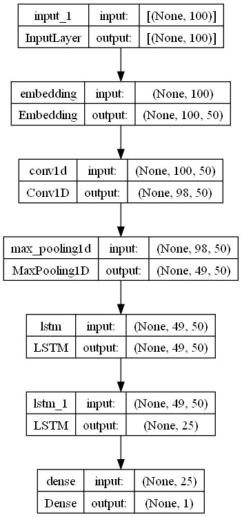
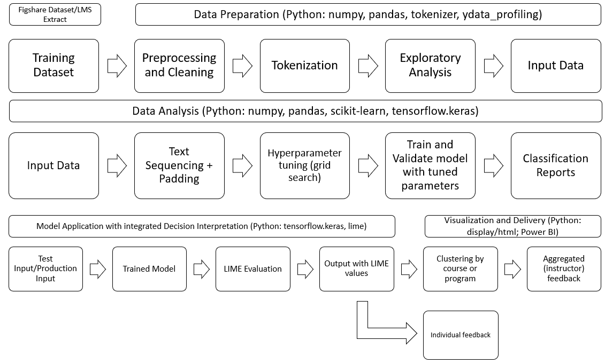

<h1>MSc Data Science Major Research Project</h1>
<h1>Adaptive Learning Management Systems Through Deep Learning</h1>
Felix Li

<h2>Description</h2>

This series of scripts first cleans and tokenizes the programming_data.json file from a [public university CS course submission dataset](https://figshare.com/articles/dataset/_5_Million_Python_Bash_Programming_Submissions_for_5_Courses_Grades_for_Computer-Based_Exams_over_3_academic_years_/12610958/1).

Then, it trains a CNN-LSTM model to predict correctness on each .py row of the file. Lastly, it uses LIME to perturb the model results to find saliency values for each token in the submitted code.

<h2>Getting Started</h2>

1. Make sure all main files are within the same directory. Main files are:
    a) mrp_main_fl.ipynb (for data exploration and initial cleaning) 
    b) mrp_model.ipynb (for training the model and subsequent cleaning)
    c) mrp_predict_lime.ipynb (for calculating LIME values and exporting dashboard data)
    d) OPTIONAL: mrp_model_new_course.ipynb (for testing the model on task-independent training/test sets)
    e) grades_data.json (from the dataset)
    f) programming_data.json (from the dataset)

2. Install prerequisite packages

3. Run mrp_main_fl.ipynb

4. Run mrp.model (optionally mrp_model_new_course). It will train a model of the following structure:

5. Run mrp_predict_lime
    a) be aware that lime value calculation on all tasks take a significant amount of time and RAM. It may be necessary to break the parquet file down into smaller chunks based on specific tasks to prevent crashes.

6. The resulting lime_values.parquet file can be used for dashboarding/analytics

<h2>Code Structure and Data Flow</h2>

<h2>Authors</h2>
* Felix Li